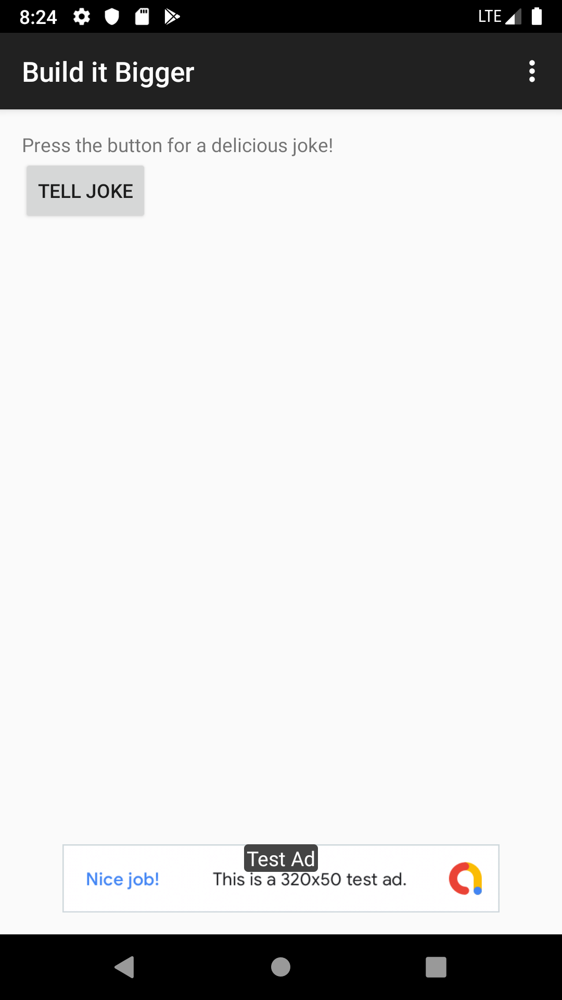
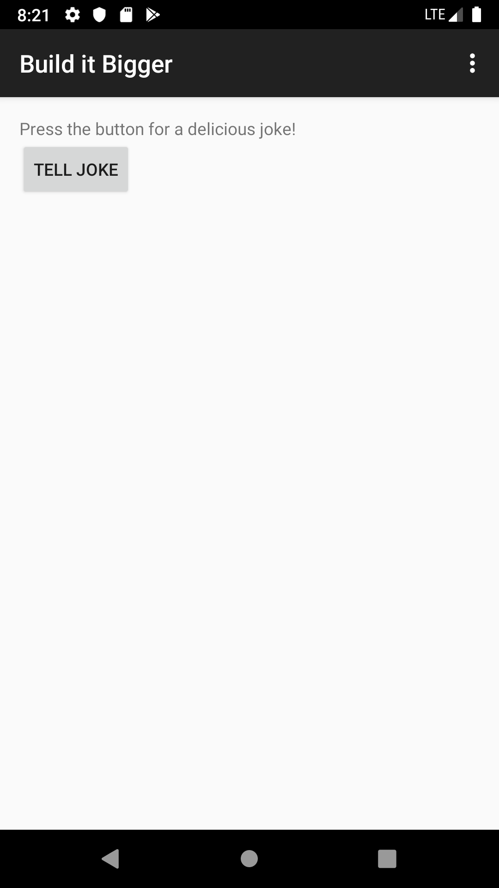
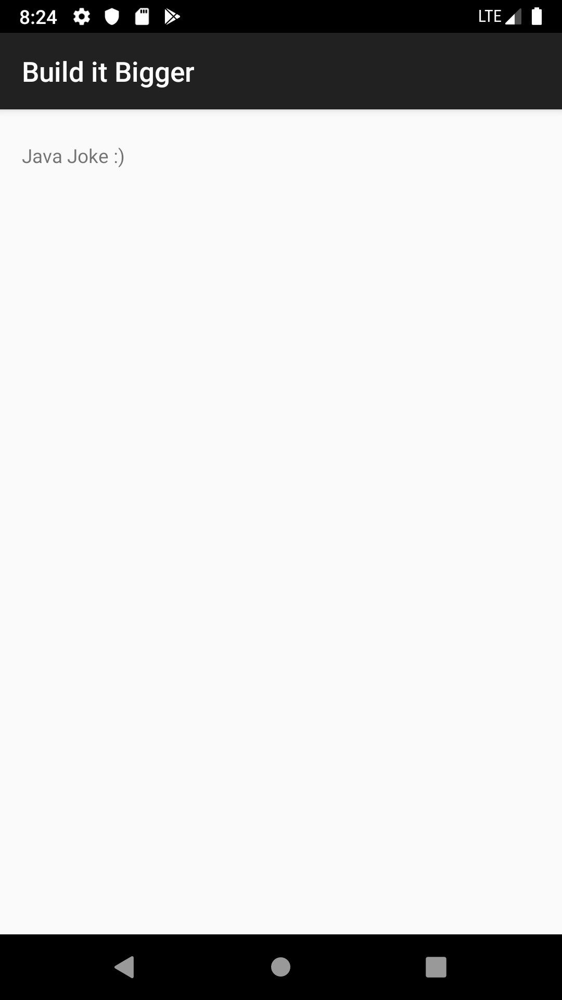

# Gradle for Android and Java Project

This is an app with multiple flavors that uses
multiple libraries and Google Cloud Endpoints. The app is consist
of four modules. A Java library that provides jokes, a Google Cloud Endpoints
(GCE) project that serves those jokes, an Android Library containing an
activity for displaying jokes, and an Android app that fetches jokes from the
GCE module and passes them to the Android Library for display.

#### Note: 
The backend library was already provided in the project and my role was to:
* Add free and paid flavors to the app, and set up my build to share code between them
* Factor reusable functionality into a Java library
* Factor reusable Android functionality into an Android library
* Configure a multi project build to compile my libraries and app
* Use the Gradle App Engine plugin to deploy a backend
* Configure an integration test suite that runs against the local App Engine development server

## Why this Project

As Android projects grow in complexity, it becomes necessary to customize the
behavior of the Gradle build tool, allowing automation of repetitive tasks.
Particularly, factoring functionality into libraries and creating product
flavors allow for much bigger projects with minimal added complexity.

## Project screenshots
#### Main Activity

##### Free Flavor

##### Paid Flavor

 
#### Joke Activity(This is the android library activity, and I used it for both free an paid flavores)

